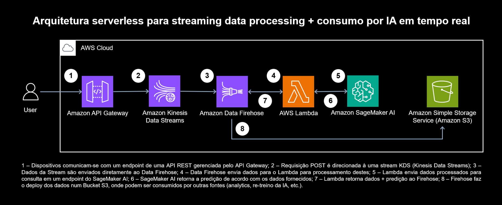

# AWS Serverless Streaming Data Pipeline + Real-Time AI Inference

Este repositório contém os artefatos de código, notebooks e documentação da arquitetura desenvolvida para a Iniciação Científica sobre **Processamento de Dados em Nuvem: Batch vs. Streaming**.

O projeto demonstra uma implementação **Serverless** na AWS capaz de ingerir dados em tempo real, processá-los, realizar inferência de Machine Learning (predição) e armazenar os resultados para análise posterior.

## 📋 Arquitetura

A solução utiliza uma abordagem orientada a eventos, integrando serviços gerenciados da AWS para garantir escalabilidade e baixa latência.

### Fluxo de Dados

1.  **Ingestão:** O cliente (dispositivo/usuário) envia dados via requisição HTTP POST para o **Amazon API Gateway**.
2.  **Streaming:** O API Gateway direciona o registro para o **Amazon Kinesis Data Streams (KDS)**.
3.  **Transporte:** O **Amazon Data Firehose** consome os dados do KDS em tempo real.
4.  **Processamento (ETL):** Antes de salvar, o Firehose invoca uma **AWS Lambda** de transformação.
5.  **Inferência (IA):** A função Lambda envia os dados brutos para um endpoint do **Amazon SageMaker AI**.
6.  **Predição:** O modelo treinado retorna a predição (ex: valor estimado).
7.  **Enriquecimento:** A Lambda une o dado original + a predição e retorna ao Firehose.
8.  **Armazenamento:** O Firehose persiste o dado enriquecido (JSON/Parquet) em um Bucket **Amazon S3**.

---

## 🛠️ Tecnologias Utilizadas

* **Linguagem:** Python 3.9+
* **IaC / Compute:** AWS Lambda, Amazon API Gateway
* **Streaming:** Amazon Kinesis Data Streams, Amazon Data Firehose
* **Machine Learning:** Amazon SageMaker (Scikit-Learn/XGBoost)
* **Storage:** Amazon S3
* **Bibliotecas:** `boto3`, `pandas`, `sagemaker`

---

## 🚀 Como Executar
### 1. Treinamento do Modelo (SageMaker)
Acesse a pasta notebooks/. O arquivo model_training.ipynb contém os passos para:

Carregar o dataset.

Treinar o modelo (ex: Regressão Linear).

Fazer o deploy do modelo em um Endpoint do SageMaker.

Nota: Copie o nome do Endpoint gerado, ele será usado na Lambda.

### 2. Configuração da Lambda
O código fonte está em lambda/firehose-sagemaker-data-processing.py. Esta função deve ser configurada como Transformer no Amazon Data Firehose.

### 3. Provisionamento da Infraestrutura (Console AWS)
Kinesis Data Stream: Crie uma stream provisionada ou on-demand.

API Gateway: Crie uma REST API integrada ao serviço Kinesis (Service Proxy).

Data Firehose: Crie uma stream de entrega.

Source: Kinesis Data Stream.

Transform: Habilite a transformação via Lambda e selecione a função criada.

Destination: Amazon S3.
